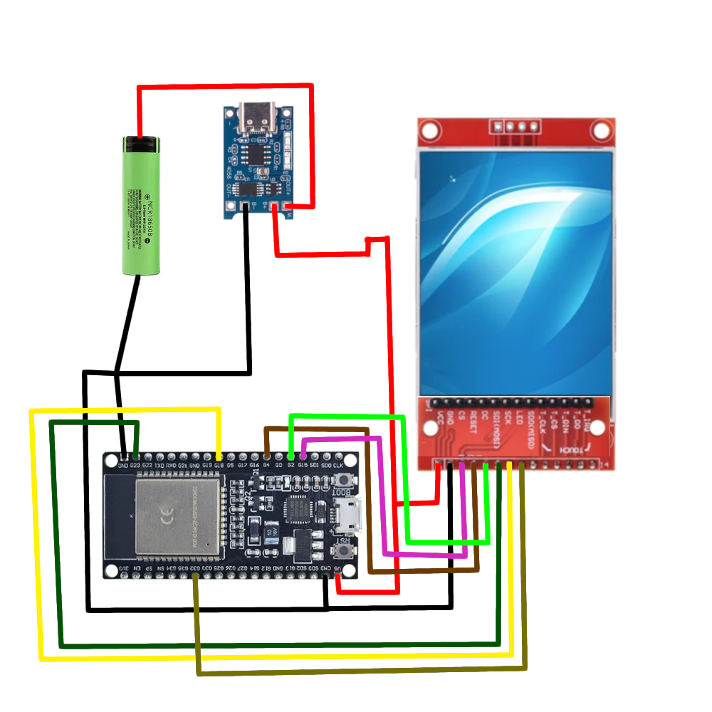

# Embedded pong

**Based on:**
* [Arduino Core for ESP32](https://github.com/espressif/arduino-esp32) component
* [Bluepad32](https://gitlab.com/ricardoquesada/bluepad32/) 
* [BTStack](https://github.com/bluekitchen/btstack)

Requires ESP-IDF **v4.4** or newer.

## How to run:
1. Install [ESP-IDF v4.4][esp-idf-windows-installer]
2. Clone the repo

   ```sh
   git clone --recursive https://github.com/kamo104/Embedded-Pong.git
   ```

3. Compile it

    ```sh
    # Compile it
    cd Embedded-Pong
    idf.py build

    # Flash + open debug terminal
    idf.py flash monitor
    ```

## Schematic:


## How it looks:
